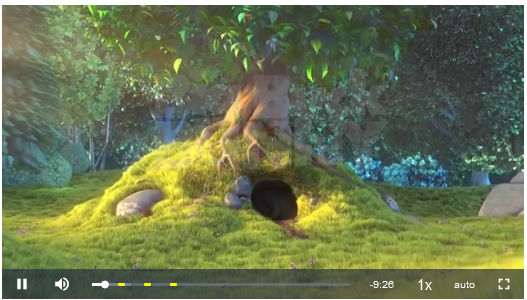

# Markers

## Enable plugin

  You can enable a plugin by passing query param **plugins** with value "markers to src URL" 

## Initialize markers
 You can intialize markers through [Player SDK](../using-player-sdk.md) method call setMarkers

 ** Arguments ** 

| Name                            | Type         | description |
| -----------                     | -----------  | ----------- |
| markerDisplay                   | Object      |  	The general css styling that would be applied to all the markers created by the plugin. The default is only concerned with width, border-radius, and background-color, but any other css rules would be applied too (think of it as jQuery's css function). 
| breakOverlay                    | Object      | Options for the break overlays at each marker. Available fields => display, displayTime, style |

You can read more about available arguments [here](http://sampingchuang.com/videojs-markers)


 ** Events ** 

| Name                            | description |
| -----------                     | ----------- |
| onMarkerReached                 | This callback function is triggered whenever playback reaches the time interval from a marker. The interval is specified in the breakOverlay.displayTime . This can be used to trigger certain actions at each marker, depending on your use case. Again, this function is given a marker instance. In 0.6.0, the function also takes in a second parameter index. |
| onMarkerClick                   | This callback function is triggered when clicking on the markers. The default behavior for clicking on the marker is seeking to that point in the video. However, if onMarkerClick returns false, the default behavior will be prevented.  |


## Methods

**Remove markers**

You can remove the particular markers by passing its indices to removeMarkers function.

``` js
player.removeMarkers([1,2,4]);
```

**Remove All markers**

``` js
player.removeAllMarkers([1,2,4]);
```

## Sample code
``` html
<!DOCTYPE html>
<html>
<body>

<div style="padding-top:56.25%;position:relative;"><iframe id="video_player" src="https://app.tpstreams.com/embed/edee9b/5b0c2695-65ab-4695-b1a5-e124c6782942/?access_token=070ca6bf-b9bf-4c3e-b039-808d7edaebda&plugins=markers" style="border:0;max-width:100%;position:absolute;top:0;left:0;height:100%;width:100%;" allow="accelerometer; autoplay; clipboard-write; encrypted-media; gyroscope picture-in-picture" allowfullscreen="" frameborder="0"></iframe></div>
<script src="https://static.testpress.in/static/js/player.js"></script>
<script>
   var player = new Testpress.Player(document.getElementById("video_player"));
    player.loaded().then(()=>{
    	player.setMarkers({
        markerStyle: {
            'width': '7px',
            'border-radius': '30%',
            'background-color': 'yellow'
        },
        markers: [{
            time: 60,
            text: "marker",
        },
        {
            time: 120,
            text: "marker2",
        },        
        {
            time: 180,
            text: "marker3",
        } 
       ]
    });
    
    })
 
    player.on("onMarkerReached", (marker, index)=>{
    	console.log("onMarkerReached", marker, index)
        player.removeMarkers([index])
    })
    
    player.on("onMarkerClick", (marker)=>{
       console.log("onMarkerClick", marker)
    })
       
</script>
  </body>
</html>
```

### Output

