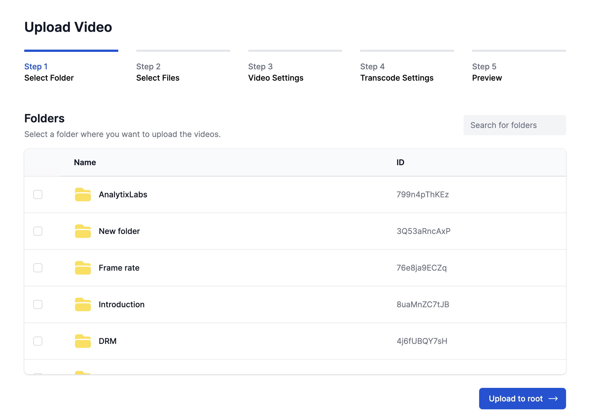
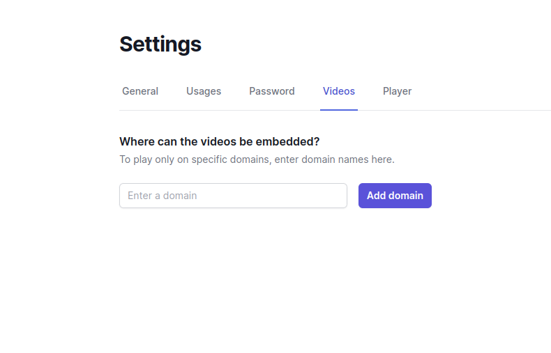

# Embedded Uploader


### Introduction
The TPStreams Uploader allows you to embed a powerful video upload tool directly on your website. With this integration, you can upload videos directly to your TPStreams account without needing to navigate away from your site, making the experience smooth and efficient. Whether you're embedding the uploader on a standalone page or in a modal, this guide will walk you through each step to get it up and running.

 


## Guide to integrate the uploader
This guide will help you integrate the TPStreams video uploader into your website allowing you to upload videos directly to your TPStreams account.


### Step 1: Get the Authentication Token
Use the API mentioned [here](../server-api/authentication.md) to obtain a user authentication token. This token is required for the uploader to authenticate uploads.


### Step 2: Import the TPStreams Uploader SDK
Include the TPStreams Uploader SDK script in your webpage. Add the following `<script>` tag in the `<head>` or right after the starting `<body>` tag:

```html
<script src="https://static.testpress.in/static/js/tpstreams-uploader.min.js"></script>
```


### Step 3: Add the TPStreams Uploader HTML Element
Place the following HTML tag where you want the uploader to appear on your webpage, including any modals if needed.
Make sure to replace the organization-id attribute with your own TPStreams organization ID.

```html
<tpstreams-uploader organization-id="your-organization-id"></tpstreams-uploader>
```

<b>Note:</b> This tag also supports `width` and `height` attributes if you need to customize the dimensions of the uploader UI.


### Step 4: Initialize the Uploader
When you are ready to display the uploader, execute the following JavaScript to initialize it with the authentication token:

```html
<script>
  const tpstreamsUploader = document.querySelector('tpstreams-uploader');
  tpstreamsUploader.authToken = '<authentication token>'; // Use token from Step 1
  tpstreamsUploader.initialize();
</script>
```


### Full Example Code
The following code will display the TPStreams uploader UI on your webpage, allowing users to upload videos directly to your account.

```html
<html>
  <head>
    <!-- TPStreams Uploader SDK -->
    <script src="https://static.testpress.in/static/js/tpstreams-uploader.min.js"></script>
  </head>
  <body>
    
    <!-- TPStreams Uploader Element -->
    <tpstreams-uploader organization-id="cmcktz"></tpstreams-uploader>
    
    <!-- Initialization Script -->
    <script>
      const uploader = document.querySelector('tpstreams-uploader');
      uploader.authToken = '<authentication token>'; // Replace with the actual token
      uploader.initialize();
    </script>
    
  </body>
</html>
```


### Domain Restrictions for Embedding
In TPStreams settings, you can restrict the allowed domains that can embed this uploader. Set the allowed domain(s) to ensure only specified sites can use your uploader. If no domain is specified, all domains are permitted by default.

 


## Uploader Events
You can listen for events in the uploader by attaching a callback using .on()

### fileUploaded
This event fires when a video is successfully uploaded to TpStreams.


```html
<script>
  const uploader = document.querySelector('tpstreams-uploader');
  uploader.authToken = '33ee07f2a51be363cc94daa460faf46b7d5ea29463aaad28ba948aa042bf871f';
  uploader.initialize();

  uploader.on('fileUploaded', (file) => {
    const fileName = file.name;
    const assetId = file.assetId;
    console.log("Filename", fileName)
    console.log("Asset ID", assetId)
  });
</script>
```